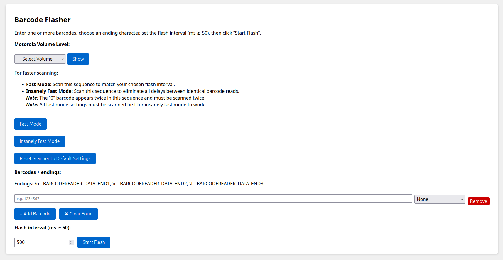

# Barcode Flasher

A Flask web app that queues custom barcode sequences and displays them on screen at precise intervals. Ideal for stress-testing and validation of any workflow that consumes live scanner input.

---

## Table of Contents

1. [Directory Structure](#directory-structure)  
2. [Prerequisites](#prerequisites)  
3. [Quickstart Guide](#quickstart-guide)  
4. [Settings](#settings)  
5. [Adding Barcodes & Flash Sequence](#adding-barcodes--flash-sequence)  
6. [Configuration](#configuration)  
7. [Server (app.py)](#server-apppy)  
8. [Barcodes Not Scanning?](#barcodes-not-scanning)  

---

## Directory Structure

```
barcode-flasher/
├── app.py
├── requirements.txt
├── static/
│   ├── illumination.png
│   ├── enablePresentation.png
│   ├── timeoutBetweenDecodes.png
│   ├── 0.png
│   ├── smallFOV.png
│   ├── defaults.png
│   ├── lowVolume.png
│   ├── mediumVolume.png
│   ├── highVolume.png
│   ├── disableBeep.png
│   ├── ui.png
│   └── enableBeep.png
└── templates/
    ├── index.html
    └── flash.html
```

---

## Prerequisites

- **Python 3.8+**
- **pip** (packaged with Python)  
- A POSIX-style shell


## Quickstart Guide

1. Clone the repo  
   ```bash
   git clone https://github.com/DuncBoi/BarcodeFlasher.git
   cd BarcodeFlasher
   ```

2. Create a virtual environment  
   ```bash
   python3 -m venv venv
   ```

3. Activate the virtual environment (choose the command that matches your shell)  
   **bash / zsh / sh**  
   ```bash
   source venv/bin/activate
   ```  
   **csh / tcsh**  
   ```csh
   source venv/bin/activate.csh
   ```  
   **fish**  
   ```fish
   source venv/bin/activate.fish
   ```

4. Install Python dependencies  
   ```bash
   pip install -r requirements.txt
   ```

5. Run the app
   ```bash
   python3 app.py
   ```
   
6. You should see something like:  
   ```  
   * Serving Flask app 'app'  
   * Debug mode: off  
   WARNING: This is a development server. Do not use it in a production deployment. Use a production WSGI server instead.  
   * Running on all addresses (0.0.0.0)  
   * Running on http://127.0.0.1:5000  
   * Running on http://10.15.57.104:5000  
   ```  
   Open one of those URLs in your browser and interact with the UI.
---

7. Now you should see something like this:


## Settings

**1. Reset to Defaults**  
Before making any changes, click **Reset Scanner to Default Settings**. The scanner will flash the `defaults.png` barcode. Scan this with the barcode reader to revert to factory parameters.

Scan one of the following barcodes to adjust the beep volume based on your preferences
- *Low Volume*: quiet beep, ideal for noise-sensitive environments.  
- *Medium Volume*: balanced feedback for general use.  
- *High Volume*: loud beep to confirm scans in loud areas.  
- *Disable Beep*: turns off all audio feedback.  
- *Enable Beep*: restores the beep after it has been disabled.  

**3. Fast Mode (Recommended for All Testing)**  
Scan these in order:  
1. *Illumination Always On* (`illumination.png`)  
   - Keeps the aimer LED and illumination lamp active at all times, eliminating warm-up delays and improving screen scan performance.  
2. *Presentation Mode* (`enablePresentation.png`)  
   - Projects a red aimer dot for precise on-screen targeting.  

**4. Insanely Fast Mode**  
Only use this if you want to really stress test the functionality.  
*Fast Mode must be scanned before Insanely Fast Mode will work.* Once Fast Mode is enabled, scan these in sequence to remove all inter-scan delays and reduce processing overhead:  
1. *Timeout Between Decodes, Same Symbol* (`timeoutBetweenDecodes.png`)  
2. *“0” Barcode* (`0.png`) – scan twice (it appears twice in the sequence).  
   - Sets the scanner’s internal delay between identical barcode scans to 0 ms (default is 400 ms).    
3. *Small Field of View* (`smallFOV.png`)  
   - Narrows the sensor’s active area, reducing processing time per scan.

---

## Adding Barcodes & Flash Sequence

On the **Index** page you can build an arbitrary sequence of barcodes, each with an optional “ending” control character. When you click **Start Flash**, the app will cycle through your list on the **Flash** page, showing each barcode fullscreen for a brief moment, then pausing until the next one.

### 1. Building your sequence

1. *Add a row*: click **+ Add Barcode** to append a new input row.  
2. *Enter your code**: in the text box, type the exact barcode data (e.g. `1234567`).  
3. *Select an ending*: choose one of:
   - **None** — no extra byte  
   - **Line Feed (\\n)** — appends ASCII 10  
   - **Carriage Return (\\r)** — appends ASCII 13  
   - **Form Feed (\\f)** — appends ASCII 12  
4. *Remove if needed*: click **Remove** on any row to delete it.  

> empty barcode fields are disallowed — you’ll get an alert if you try to submit with blank rows.

### 2. Setting the flash interval

- The **Interval** input (in milliseconds) controls the length of time between subsequent flashes in your sequence, the actual barcode itself is only flashed for 0.4 seconds.  
- **Boundaries**: must be an integer ≥ 50. If you enter less than 50, the server will reject it with an error.  

## Configuration

- **Port & Host**: default is `0.0.0.0:5000`. Change in `app.py` or set via environment if using a WSGI server.  
- **Flash GIFs / Images**: put any extra `.png` files under `static/`. Filenames must match the JS arrays in `index.html`/`flash.html`.  
- **Interval Limits**: minimum 50 ms between barcode starts. Change in both client-side validation (`min="50"`) and server (`if interval_ms < 50`).  

---

## Server (app.py)

- **GET /**  
  Renders `index.html`.

- **POST /**  
  - Reads `barcodes[]` and `endings[]`.  
  - Maps endings (`None`, `LF`, `CR`, `FF`) to literal control characters.  
  - Filters out empty barcode entries.  
  - Validates `interval ≥ 50 ms`.  
  - Builds `flash_list` of `{ label, img_url }` entries, URL-encoding each code.  
  - Renders `flash.html` with the resulting lists.

- **GET /barcode.png**  
  - Accepts `?code=` and optional `?type=` (default `code128`).  
  - Chooses from `code128`, `ean13`, `ean8`, `upca` classes.  
  - Writes the barcode to memory with custom `module_width`/`module_height`.  
  - Returns raw PNG or a `400`/`500` error with a helpful message


## Barcodes Not Scanning?

If barcodes are too small or too large on screen, the scanner may fail to read them reliably.

### Modifying Dimensions of the Server-Generated Barcodes

In **app.py**, locate the `bc.write(buf, options)` call:

```python
bc.write(buf, {"module_width": 0.2, "module_height": 15.0})
```

- **`module_width`** controls the width of each barcode bar (in mm). Increasing this makes the barcode wider.  
- **`module_height`** controls the height of the bars (in mm). Increasing this makes the barcode taller.

**Optional:** you can also tweak writer options like `font_size`, `text_distance`, and `quiet_zone`:

```python
bc.write(buf, {
    "module_width": 0.3,
    "module_height": 25.0,
    "font_size": 10,
    "text_distance": 1.0,
    "quiet_zone": 6.5
})
```

### Modifying Dimensions of the Settings Barcodes (Volume, Fast Mode, etc.)

In `index.html` find the following snippets and modify the width and height to your liking:

```html
<style>
  /* make volume preset bigger */
  #volumeOverlayImg {
    width: 30vw;
    height: 30vh;
  }

  /* make fast/insane mode images bigger */
  #fastOverlayImg {
    width: 25vw;
    max-height: 25vh;
  }
</style>
```


